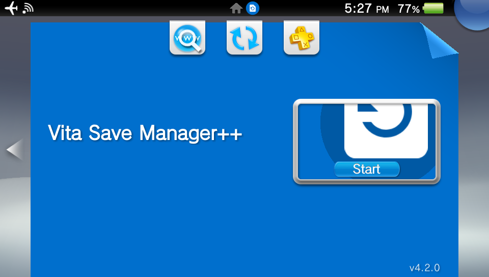
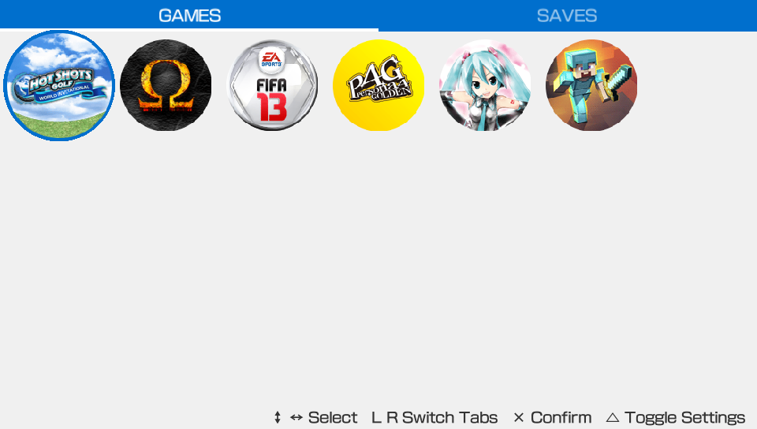
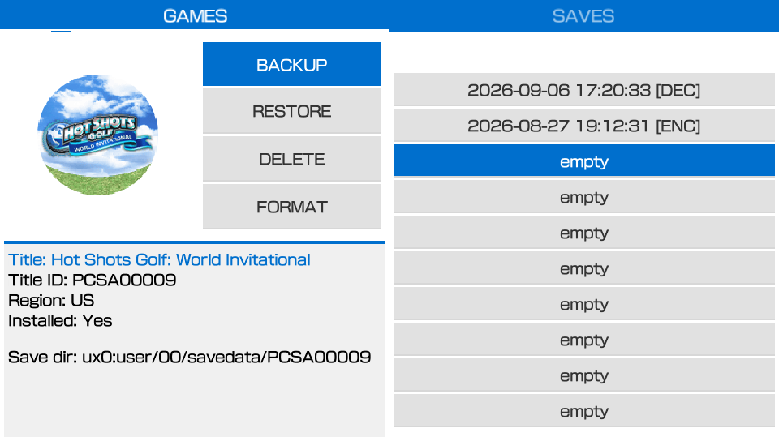
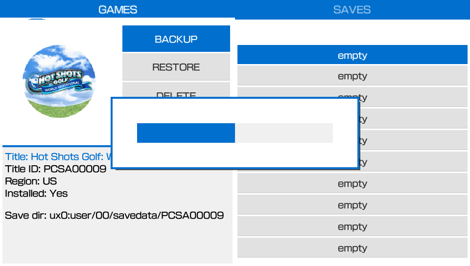
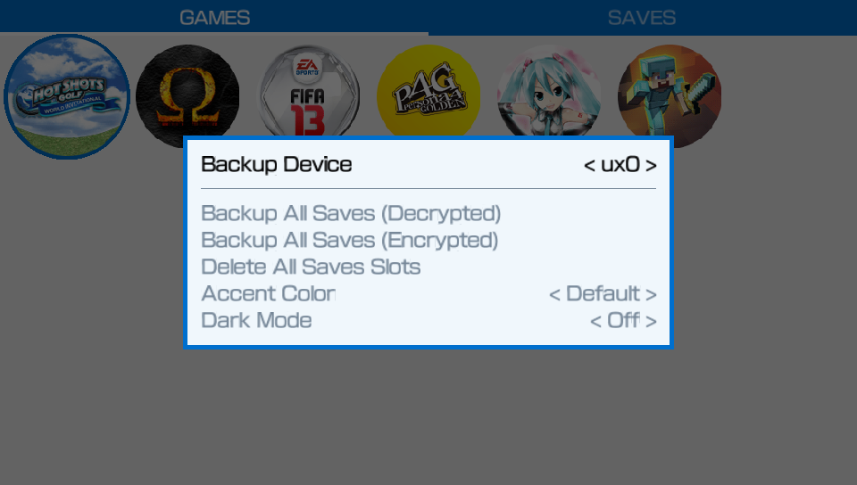
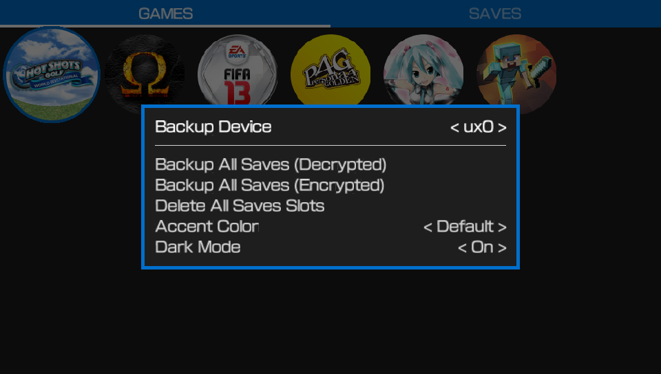
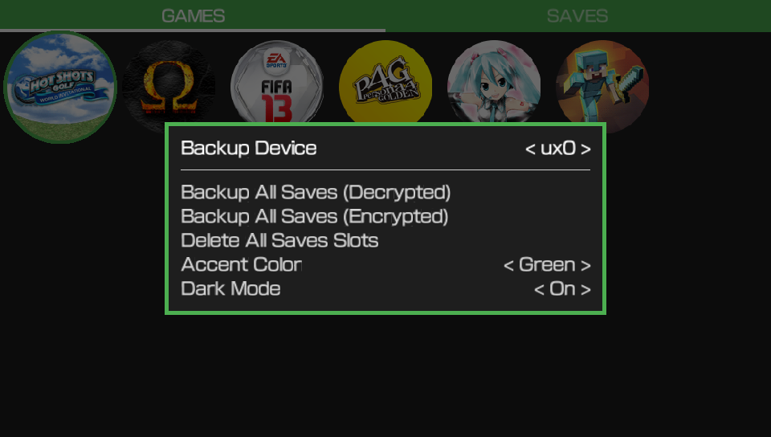

<p align="center"></p>

# Vita Save Manager++

Vita Save Manager++ is a fast, highly optimized, and customizable save data manager for the PS Vita. This project is a refactored fork of **Vita Save Manager Plus**.
<br><br>
**NOTE: VitaShell modules are required for this application to run. So you need to have VitaShell installed.**<br>
If VitaShell is not installed in your PS Vita, then copy `kernel.skprx` and `user.suprx` from VitaShell vpk to `ux0:data/vitaSaveManager/`.

## Changelog
See [CHANGELOG.md](CHANGELOG.md).

## Features
- Backup saves as decrypted or encrypted
- Bulk backup of all your saves
- Bulk delete of all your backups
- Restore encrypted and decrypted saves
- Change savefile region
- Select your prefered device to use as the backup device (`ux0:`, `ur0:`, `uma0:`, `imc0` or `xmc0:`)
- Customize UI (choose between Dark/Light Mode, and pick from different accent colors)

## Controls
D-Pad / Left Analog / Touch : Select<br>
L / R : Switch Tabs (GAMES / SAVES)<br>
╳ / ◯ / Touch : Confirmation<br>
△ : Toggle Settings

## Screenshots
<p align="center">
  <table>
    <tr>
      <td></td>
      <td></td>
    </tr>
    <tr>
      <td></td>
      <td></td>
    </tr>
    <tr>
      <td></td>
      <td></td>
    </tr>
  </table>
</p>

## Building
Use [VitaSDK](https://github.com/vitasdk) and build the project using CMake.
```bash
mkdir build
cd build && cmake ..
make
```

## License
This project is licensed under [GPLv3](LICENSE).

## Credits
- [VitaShell by TheFloW](https://github.com/TheOfficialFloW/VitaShell)<br>
- [rinCheat by Rinnegatamante](https://github.com/Rinnegatamante/rinCheat)<br>
- [Vita Save Manager by d3m3vilurr](https://github.com/d3m3vilurr/vita-savemgr)<br>
- [Vita Save Manager Plus by kylon](https://bitbucket.org/kylon/vita-savemgr/)
